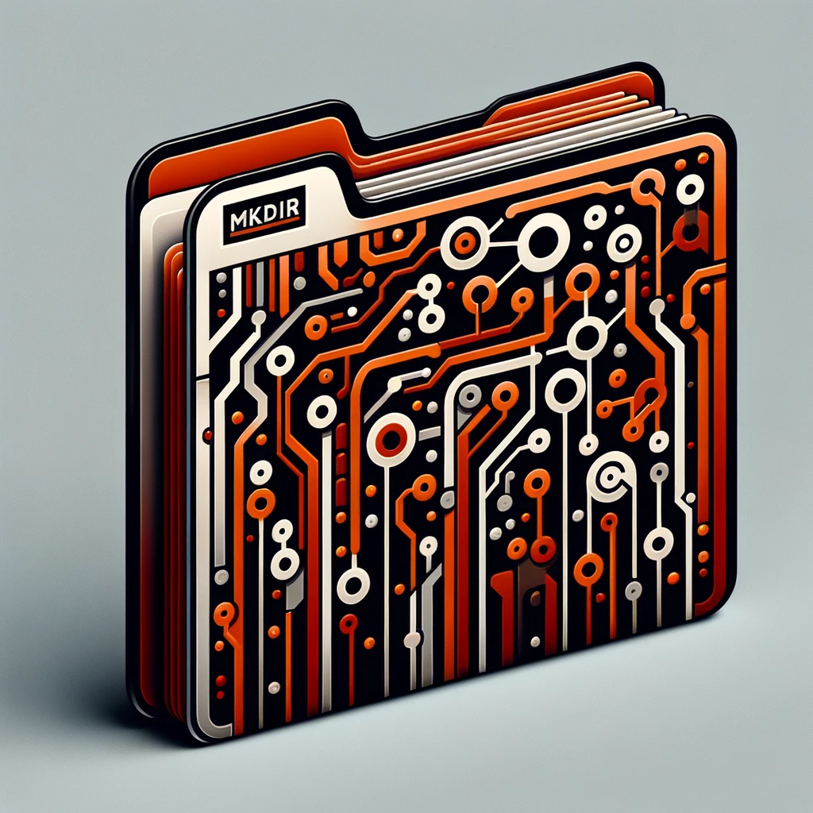

# <p align = "center">mkdir：用 Rust 改写 Linux</p>



欢迎来到 **mkdir** 团队的官方 GitHub 仓库，我们的项目致力于用 Rust 语言重写 Linux 操作系统。我们的目标是利用 Rust 的安全性和性能，为世界上最具影响力的操作系统之一带来全新的视角。

## 团队成员

- 潘铂凯 - 组长
- 胡揚嘉 - 组员
- 王翔辉 - 组员
- 刘宇恒 - 组员
- 金培晟 - 组员
- Saint XK - 技术顾问

## 关于项目

Linux 一直是开源世界的基石，其多功能性和稳定性使得其应用广泛。随着 Rust —— 一种为安全和速度而设计的语言的出现，我们看到了将 Linux 引入新时代的机会。我们的目标是保持 Linux 的本质，同时充分利用 Rust 的现代特性。

### 为什么选择 Rust？

- **内存安全**：Rust 的所有权模型确保了安全的内存管理，降低了错误和漏洞的风险。
- **并发性**：Rust 对并发的处理方式允许更安全、更高效的多线程编程。
- **性能**：Rust 提供与 C 相媲美的性能，使其成为系统级编程的理想选择。
- **社区支持**：Rust 拥有日益增长的社区，并在各个领域越来越多地被采用。

## 快速开始

要为 mkdir 项目做贡献，或者在本地构建项目，请按照以下步骤操作：

1. **克隆项目：**
   - 使用以下命令将项目克隆到本地：
     ```
     git clone git@github.com:Jarfield/mkdir
     ```

2. **创建分支：**
   - 在克隆的项目目录中，使用以下命令创建并切换到新的分支（假设你要做的工作是添加新功能或修复 bug）：
     ```
     git checkout -b <branch-name>
     ```
   - 请用描述性的分支名称替换 `<branch-name>`。

3. **进行修改：**
   - 在本地仓库中进行你的修改和工作。

4. **提交更改：**
   - 使用以下命令将你的修改提交到本地仓库：
     ```
     git add .
     git commit -m "描述你的修改"
     ```

5. **推送更改：**
   - 如果你希望将你的修改推送到远程仓库，使用以下命令：
     ```
     git push origin <branch-name>
     ```
   - 请用你所创建的分支名称替换 `<branch-name>`。

6. **创建 Pull Request：**
   - 在 GitHub 上导航到你的仓库页面。
   - 点击 "New pull request" 按钮。
   - 选择要比较的分支，确保将你的分支与目标分支进行比较。
   - 撰写有关你的 Pull Request 的信息，然后点击 "Create pull request"。

7. **等待审核和合并：**
   - 项目维护者将会审查你的 Pull Request，并可能会提出建议或请求修改。
   - 一旦你的修改被审查并接受，你的 Pull Request 将被合并到主分支中。

## 贡献
无论您对 Rust 或操作系统的经验水平如何，我们都欢迎每个人的贡献。

## 许可证
本项目采用 `GNU 通用公共许可证 v2.0` 许可。

## 联系方式
如有任何关于项目的询问或讨论，欢迎开设 `issue` 或通过 `QQ群：881491834`  联系我们。

祝编码愉快！

mkdir 团队
