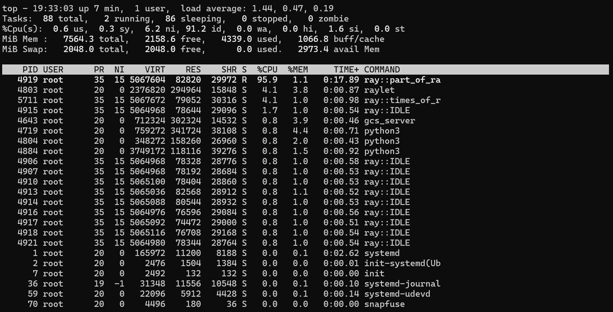
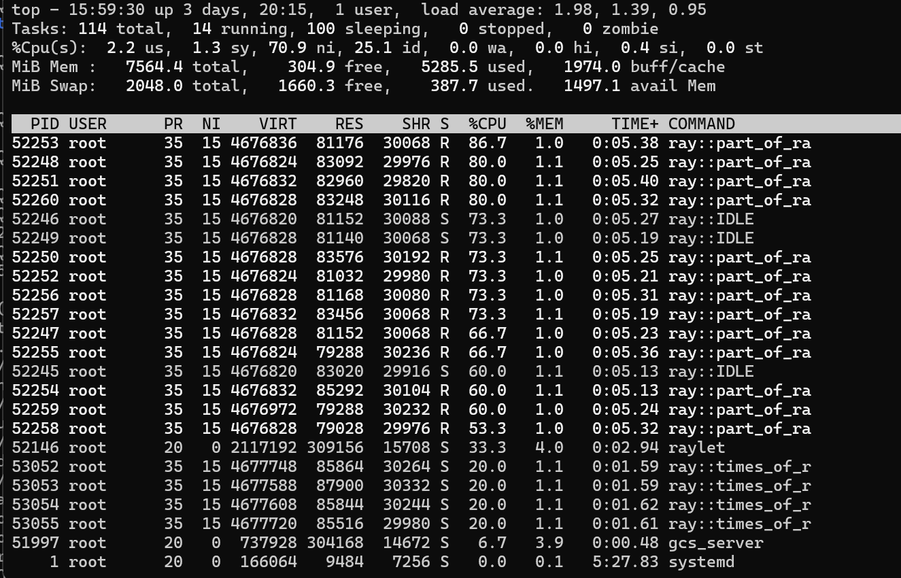

# Ray
## 计算任务
利用蒙特卡罗方法模拟二维随机游走，通过多次重复实验，得到最后停止位置的期望值。其中各个方向步长取为1，游走次数取为100000，实验重复次数取为10000。这样在保证计算量的同时，还可以通过已有知识确定期望值为(0,0)，判断程序输出是否正确。
## 性能指标
1. cpu使用率：CPU使用率直接反映了程序对CPU资源的利用程度。高CPU使用率可能表明程序能够有效利用处理器资源，而低CPU使用率意味着可能存在性能瓶颈或者程序未能充分利用CPU资源。
2. 任务执行时间：包括任务的总执行时间、平均执行时间等。
3. 吞吐量：吞吐量衡量了单位时间内系统能处理的工作量，直接反映了系统的处理能力。
4. 内存使用率：内存使用率提供了程序在运行过程中对内存资源的消耗情况。
5. 平均响应时间：平均响应时间提供了一个量化的指标来衡量系统处理请求的效率。

在这次实验中，我们小组选择cpu使用率、任务总执行时间、吞吐量作为主要性能指标进行测试，因为这些量具有代表性且易于测量。
## 测试过程
### 单机不部署ray
代码如下所示：
```python
import random
import time
const_n=1_0000 #随机游走次数
const_step=10_0000 #每次随机游走步数
def random_walk(n):
    x, y = 0, 0
    for i in range(n):
        (dx, dy) = random.choice([(0, 1), (0, -1), (1, 0), (-1, 0)])
        x += dx
        y += dy
    return (x, y)

start_time=time.time()
n=const_n
step=const_step
x=0
y=0
for i in range(n):
    walk = random_walk(step)
    x+=walk[0]
    y+=walk[1]
print(x/n,y/n,time.time()-start_time)

```
cpu使用率测试结果如下:

如图所示单核可以跑到100%（单核上限200%）


任务总执行时间测试结果如下: 306.4s


吞吐量测试结果如下: 

随机游走的次数10000为任务量，用时306.4s,则吞吐量为10000/306.4=32.64次/s


### 单机部署ray（1个用于计算的节点）
代码如下所示：
```python
import random
import time
import ray
const_n=1_0000
const_step=10_0000
const_task_num=1
const_part_num=1
@ray.remote
class times_of_random_walk:
    def __init__(self,step,k,parts):
        self.step=step
        self.k=k
        self.parts=parts
    def random_walk(self):
        m=self.step//self.parts
        x=0
        y=0
        id_list=[]
        for i in range(self.parts):
            id_list.append(part_of_random_walk.remote(m))
        for i in range(0,len(id_list)):
            (dx, dy)=ray.get(id_list[i])
            x += dx
            y += dy
        return (x, y)
    def run_k_times(self):
        x=0
        y=0
        for i in range(self.k):
            walk = self.random_walk()
            x+=walk[0]
            y+=walk[1]
        return (x,y)
@ray.remote
def part_of_random_walk(m):
    x=0
    y=0
    for i in range(m):
        (dx, dy) = random.choice([(0, 1), (0, -1), (1, 0), (-1, 0)])
        x += dx
        y += dy
    return (x, y)

ray.init()
start_time=time.time()
n=const_n
k=n//const_task_num
id_list=[]
for i in range(const_task_num):
    t=times_of_random_walk.remote(const_step,k,const_part_num)
    id_list.append(t.run_k_times.remote())
x=0
y=0
for i in range(0,len(id_list)):
    walk=ray.get(id_list[i])
    x+=walk[0]
    y+=walk[1]
print(x/n,y/n,time.time()-start_time)
```



如上图所示：计算所用的节点cpu使用率约为95.9%

任务总执行时间测试结果如下: 334.07s


吞吐量测试结果如下:
10000/334.07=29.94次/s


### 单机部署ray（更多拆分任务以优化性能）
为进一步发挥出ray的分布式计算性能，将游走次数等分为4份，实验重复次数等分为4份，这样会用到至少20个节点进行相应的计算，利用并行计算优化性能。

代码如下所示：
```python
import random
#import math
import time
import ray
const_n=1_0000
const_step=10_0000
const_task_num=4
const_part_num=4
......
```
cpu使用率测试结果如下:

如下图所示，综合利用率约为950%

任务总执行时间测试结果如下: 
57.4s

吞吐量测试结果如下:
10000/57.4=174.83次/s

### Docker部署ray

#### 启动4个节点
头结点top监控(下图中第一行的计算节点可能正处于任务转换，故显示command为ray::IDLE，但由其cpu使用率可以看出其是工作节点)


- cpu使用率约200%
- 运行时间182.4s
- 吞吐量约为10000/182.4=54.8次/s

## 结论
首先根据以上测试我们可以得到如下表格：
| 运行方式 | cpu使用率/% | 任务总执行时间/s | 吞吐量(任务数/s) |
|:------------:|:--------:|:-------:|:----:|
| 单机不部署ray  |  100  |   306.4  |      32.64   |
| 单机部署ray（单个计算节点）  |  95.9  |   334.07  |      29.94   |
| 单机部署ray（有任务拆分）  | 950  |   57.4  |      174.83   |
| Docker部署ray （启动4个容器节点） |   200  |   182.4  |      54.8   |

经过对比，可以看到 单机部署ray（有任务拆分）的性能最优，吞吐量最高，任务总执行时间最短，cpu使用率最高。而单机不部署ray的性能最差，吞吐量最低，任务总执行时间最长，cpu使用率最低。Docker部署ray的性能介于两者之间，吞吐量和任务总执行时间都比单机不部署ray好，可能由于wsl有资源限制，cpu使用率不如单机部署ray。

比较单个计算节点和有任务拆分的部署，可以看到有任务拆分的部署的性能更好，吞吐量更高，任务总执行时间更短，cpu使用率更高。这是因为有任务拆分的单机部署ray可以更好地利用多个节点的计算资源，提高了计算效率。