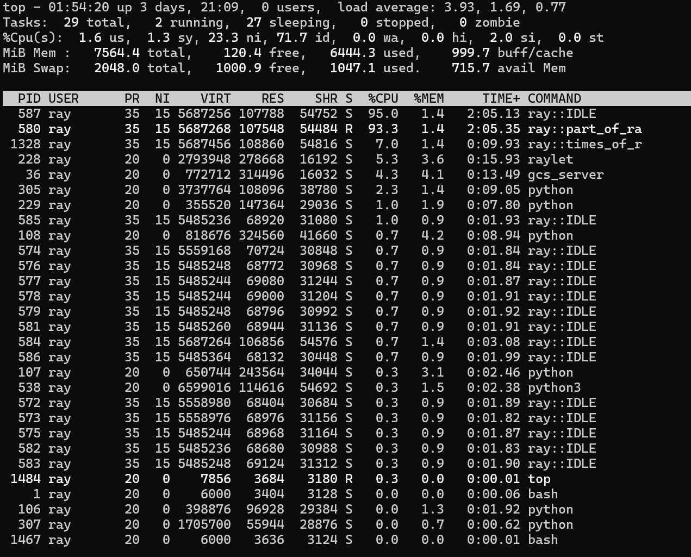

# Ray
## 计算任务
利用蒙特卡罗方法模拟二维随机游走，通过多次重复实验，得到最后停止位置的期望值。其中各个方向步长取为1，游走次数取为100000，实验重复次数取为10000。这样在保证计算量的同时，还可以通过已有知识确定期望值为(0,0)，判断程序输出是否正确。
## 性能指标
1. cpu使用率：CPU使用率直接反映了程序对CPU资源的利用程度。高CPU使用率可能表明程序能够有效利用处理器资源，而低CPU使用率意味着可能存在性能瓶颈或者程序未能充分利用CPU资源。
2. 任务执行时间：包括任务的总执行时间、平均执行时间等。
3. 吞吐量：吞吐量衡量了单位时间内系统能处理的工作量，直接反映了系统的处理能力。
4. 内存使用率：内存使用率提供了程序在运行过程中对内存资源的消耗情况。
5. 平均响应时间：平均响应时间提供了一个量化的指标来衡量系统处理请求的效率。

在这次实验中，我们小组选择cpu使用率、任务总执行时间、吞吐量作为主要性能指标进行测试，因为这些量具有代表性且易于测量。
## 测试过程
### 单机不部署ray
代码如下所示：
```python

```
cpu使用率测试结果如下:

如图所示单核可以跑到100%（单核上限200%）


任务总执行时间测试结果如下: 306.4s


吞吐量测试结果如下: 

随机游走的次数10000为任务量，用时306.4s,则吞吐量为10000/306.4=32.64次/s


### 单机部署ray（拆分任务以优化性能）
为进一步发挥出ray的分布式计算性能，将游走次数等分为4份，实验重复次数等分为4份，这样会用到至少20个节点进行相应的计算，利用并行计算优化性能。

代码如下所示：
```python
```
cpu使用率测试结果如下:

如下图所示，综合利用率约为950%

任务总执行时间测试结果如下: 
57.4s

吞吐量测试结果如下:
10000/57.4=174.83次/s

### Docker部署ray

#### 启动4个节点
头结点top监控



## 结论
首先根据以上测试我们可以得到如下表格：
| 运行方式 | cpu使用率 | 任务总执行时间 | 吞吐量 |
|:------------:|:--------:|:-------:|:----:|
| 单机不部署ray  |    |    |          |
| 单机部署ray（无任务拆分）  |     |    |
| 单机部署ray（有任务拆分）  |     |    |
| Docker部署ray  |     |    |          |

经过对比，可以看到